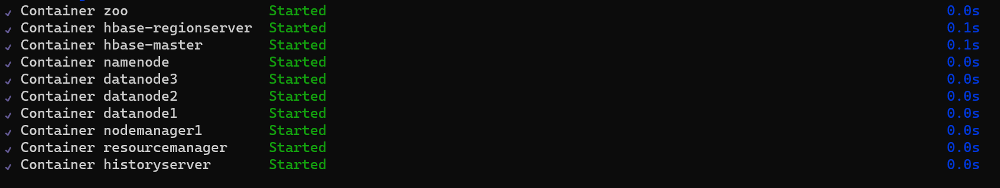
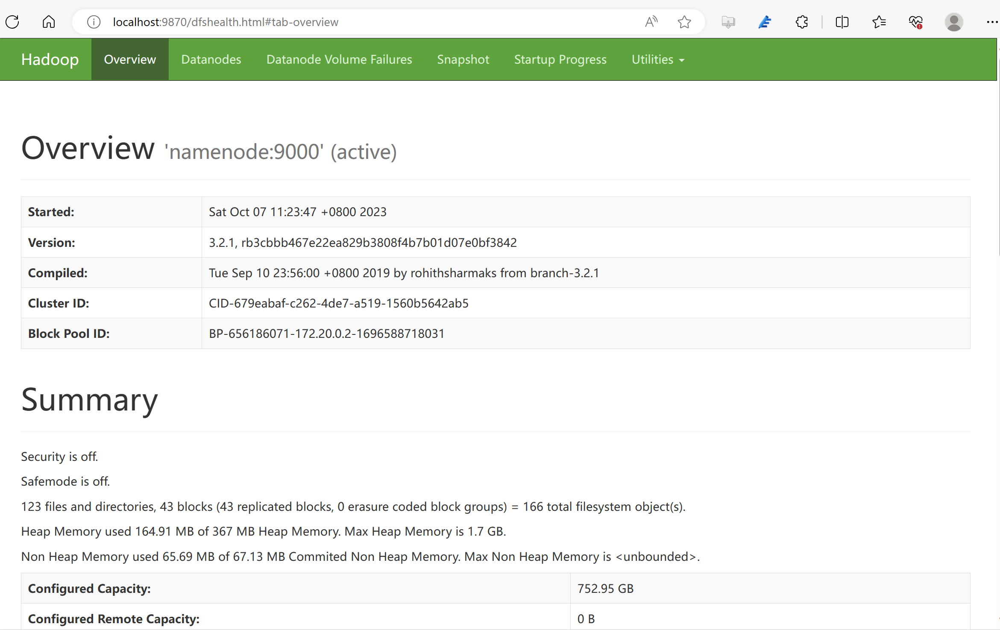
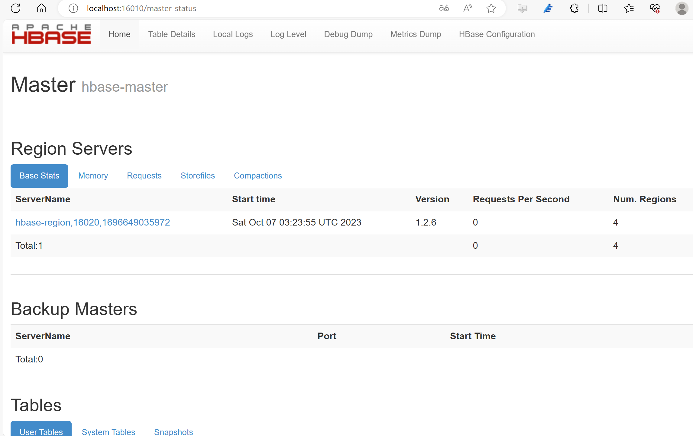
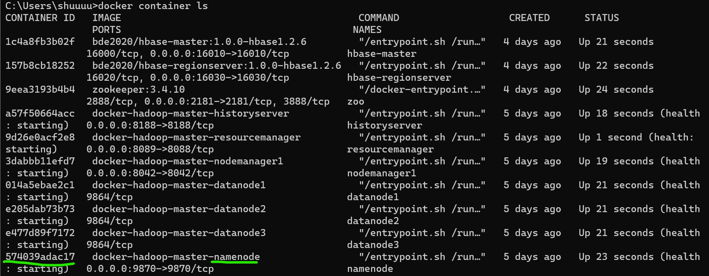
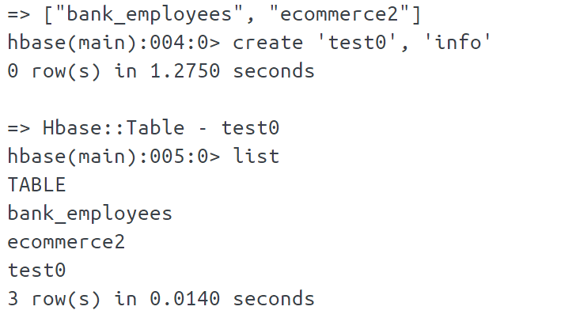

# Hadoop-HBase Docker

## 说明
在 [MahdaviNejad/docker-hadoop](https://github.com/MahdaviNejad/docker-hadoop)基础上增加了HBase，可实现在主系统上快速部署，免去配置环境烦恼。需安装docker


## 快速开始

### 安装docker desktop

https://www.docker.com/download

### 进入项目目录


Run :
```
  $ docker-compose up -d
```
共启动10个容器：

测试Hadoop和hbase管理界面均可进入：



### 测试pi实例

首先将目录内的hadoop-mapreduce-examples-2.5.1.jar包拷贝至namenode容器中：
```
  $ docker cp ./hadoop-mapreduce-examples-2.5.1.jar namenode容器ID:hadoop-mapreduce-examples-2.5.1.jar
```

其中的namenode容器id可以直接在docker desktop主界面拷贝,
或通过`$ docker container ls`命令查看:
run: `hadoop jar hadoop-mapreduce-examples-2.5.1.jar pi 10 10`


### 测试使用hbase


成功
